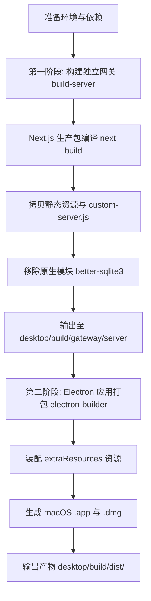

# iRouter 桌面端打包与构建指南

本指南详细记录 iRouter 跨平台桌面端应用的手动打包流水线、构建原理、平台命令及排错方案，供日常构建发布与调试参考。

---

## 一、打包架构与全景流程

iRouter 桌面端采用 **双层解耦架构**（网关源码基于上游 v0.5.69 定制，位于仓库根目录）：

- **内嵌网关层（仓库根目录 `src/` + `open-sse/`）**：基于 Next.js 16 Standalone 服务端，集成 SQLite 数据存储与原生多语言支持；
- **桌面壳层 (`desktop/`)**：基于 Electron 44 容器，负责系统托盘、多实例管理、原生菜单、系统深浅色/语言跟随与数据目录持久化。



---

## 二、前置环境要求

在开始打包前，请确保本地构建环境满足以下条件：

| 工具 / 依赖 | 最低版本要求 | 说明 |
| :--- | :--- | :--- |
| **Node.js** | `>= 20.0.0` (推荐 22.x 或 26.x) | 必须包含内建 `node:sqlite` 或 `node:crypto` |
| **npm** | `>= 10.0.0` | 推荐使用 Node 随附的官方 npm |
| **macOS SDK** | macOS 12+ (若打包 macOS 应用) | Xcode Command Line Tools (`xcode-select --install`) |
| **磁盘空间** | 空闲空间 `>= 3 GB` | 编译 Next.js 与解包 Electron 临时文件所需 |

---

## 三、一键打包（推荐）

如果只需产出最终安装包，在 `desktop/` 目录下执行对应平台的一键脚本即可：

```bash
# 切换至桌面端工程目录
cd desktop

# 1. 确保安装全部开发依赖（本机若配置了 NODE_ENV=production，必须带 --include=dev）
npm install --include=dev --no-audit --no-fund

# 2. 一键构建 macOS 安装包（自动完成网关编译 + DMG 打包）
npm run dist:mac
```

> **其他平台对应命令**：
>
> - **Windows**：`npm run dist:win`（产出 `.exe` 便携版与 NSIS 安装包）
> - **Linux**：`npm run dist:linux`（产出 `.AppImage` 与 `.deb` 包）

---

## 四、分步手动打包详解

当需要排查打包故障或定制中间产物时，可按以下标准步骤逐步执行。

### 第一阶段：构建内嵌网关服务端 (`build-server`)

该步骤将上游 Next.js 独立包及其依赖整合成自包含的服务端，并输出到 `desktop/build/gateway/server/`。

```bash
cd desktop
npm run build-server
```

#### 该步骤内部自动执行的关键操作

1. **环境净化**：清理宿主机泄漏的 `__NEXT_PRIVATE_*`、`PORT`、`HOSTNAME` 等环境变量，防止 Next.js 读取泄漏配置导致编译崩溃；
2. **Next.js 独立包构建**：在仓库根目录执行 `npm install` 并运行 `next build --webpack`，生成 `.next/standalone` 生产输出；
3. **资产与入口同步**：将 `.next/static`、`public` 资源以及 `custom-server.js` 统一归集至独立包目录；
4. **便携化处理（剥离原生依赖）**：从 `node_modules` 中剔除依赖宿主 Node ABI 版本的 C++ 原生模块 `better-sqlite3`，确保运行时平滑走 Node 内建 `node:sqlite` 或便携式 `sql.js`。

---

### 第二阶段：Electron 桌面应用打包 (`electron-builder`)

网关服务端构建完成后，执行 `electron-builder` 进行桌面封装。

```bash
cd desktop

# macOS 默认架构打包（根据当前机器架构，Apple Silicon 为 arm64）
npx electron-builder --mac

# 若需显式指定 Apple Silicon (M1/M2/M3/M4) 架构
npx electron-builder --mac --arm64

# 若需为 Intel x64 架构打包
npx electron-builder --mac --x64

# 若需打包通用双架构二进制 (Universal)
npx electron-builder --mac --universal
```

#### 打包配置文件 `electron-builder.yml` 关键机制

- **`extraResources` 封装**：将 `build/gateway/server` 封装进应用安装包的 `Resources/gateway/server`；
- **硬排除规则避坑**：网关路径嵌套在 `gateway/server` 下，避开 electron-builder 对根目录 `node_modules` 的强制排除机制；
- **签名跳过**：`identity: null` 显式声明跳过 Apple 开发者证书签名与公证，适合团队内测与本地分发。

---

## 五、打包产物说明与安装验证

打包完成后，产物位于 `desktop/build/dist/` 目录：

```text
desktop/build/dist/
├── iRouter-0.1.7.dmg            <-- [发布交付] macOS 磁盘镜像安装包（约 149 MB）
├── iRouter-0.1.7.dmg.blockmap   <-- 块更新校验文件
├── builder-debug.yml            <-- 构建配置调试快照
└── mac-arm64/                   <-- [本地运行/测试] 解包后的完整应用目录
    └── iRouter.app              <-- 可直接双击运行的应用程序包
```

### 首次安装与运行说明（macOS）

1. 双击打开 `iRouter-0.1.7.dmg`，将 `iRouter.app` 拖入 `/Applications`（应用程序目录）；
2. **绕过 Gatekeeper 安全拦截**（由于未签名）：
   - **方式一（GUI）**：在「访达 → 应用程序」中，**按住 Control 键并右键点击 iRouter.app**，选择「打开」，在弹窗中再次点击「打开」；
   - **方式二（系统设置）**：打开「系统设置 → 隐私与安全性」，滚动到最下方，点击「仍要打开」；
   - **方式三（终端命令）**：

     ```bash
     xattr -cr /Applications/iRouter.app
     ```

3. 之后正常双击启动即可，无需重复上述操作。

### 核心功能验证检查清单

启动应用后，可按以下列表快速验收核心能力：

- [ ] **品牌与版本展示**：侧边栏与个人设置页（`/dashboard/profile`）底部均展示为 `iRouter Proxy v0.1.7`；
- [ ] **多语言设置**：个人设置页内联分段切换器（跟随系统、英文、简体中文、繁体中文）平滑切换；
- [ ] **数据持久化路径**：个人设置页“数据库位置”卡片显示为 `~/.irouter/db/data.sqlite`；
- [ ] **下载备份命名**：点击“下载备份”，确认生成文件名为 `irouter-backup-<时间戳>.json`；
- [ ] **使用情况换算**：进入“使用情况”页面，统计卡片大于 10000 的 Token 自动换算为万/亿（如 `31.04 亿`、`1,364.46 万`），鼠标悬停显示精确原值。

---

## 六、常见问题与排错指南 (Troubleshooting)

### 1. Next.js 构建提示 `TypeError: generate is not a function`

- **原因**：宿主 Shell 环境变量中残留了其他 Next.js 项目的私有配置（如 `__NEXT_PRIVATE_STANDALONE_CONFIG`）；
- **解决办法**：
  `desktop/scripts/build-server.mjs` 已做自动环境净化。若手动调试 Next.js，需在干净终端执行：

  ```bash
  unset __NEXT_PRIVATE_STANDALONE_CONFIG NEXT_DIST_DIR NEXT_DEPLOYMENT_ID
  ```

### 2. 提示 `better-sqlite3 was compiled against a different Node.js version`

- **原因**：开发环境中编译的 C++ 模块与 Electron 的 Node ABI（NODE_MODULE_VERSION）不匹配；
- **解决办法**：无需关心。iRouter 运行时已设计自动优雅降级，优先调用 Node 内建 `node:sqlite` 或 `sql.js` 纯 JS 引擎，数据库读写完全不受影响。

### 3. 端口占用与双开提示

- **现象**：启动时提示“系统已有一个正在运行的 iRouter 实例并占用默认端口 20128”；
- **解决办法**：
  - 点击「退出」，并在菜单栏/托盘退出旧实例后再重新打开；
  - 或点击「以独立实例双开运行」，新实例会自动顺延到 20129 端口并将数据隔离在 `~/.irouter-multi`。

### 4. 构建前完全清理旧缓存（Clean Build）

如果修改了底层代码或资源，希望完全重头构建，可执行清理命令：

```bash
# 清理 desktop 构建缓存与旧产物
rm -rf desktop/build

# 清理 9router 编译缓存（源码在仓库根目录）
rm -rf .next

# 重新执行打包
cd desktop && npm run dist:mac
```

### 5. electron-builder 反复下载 electron（约 130MB）导致打包慢

**现象**：`dist:mac` / `electron-builder --mac` 每次都在日志出现 `downloaded label=electron progress=100%`，且 `~/Library/Caches/electron/` 下的 zip 每次被重写；网络不稳时甚至卡到 `Timeout awaiting 'request' for 600000ms` 直接失败。
**原因**：@electron/get 对缓存的校验/下载链路依赖 GitHub Release，网络抖动时校验失败即整包重下。
**解决办法（已内置，一般无需手动处理）**：

- 打包脚本 `desktop/scripts/package.mjs` 固定走国内镜像：electron 主包与 electron-builder 工具包（dmg-builder/icons）分别经 `ELECTRON_MIRROR` / `ELECTRON_BUILDER_BINARIES_MIRROR` 指向 npmmirror；`electron-builder.yml` 另有 `electronDownload.mirror` 兜底。
- 因此统一用 `npm run dist:mac`（内部走 package.mjs），不要直接 `npx electron-builder`。
- 需要覆盖镜像时用环境变量（如内网代理镜像）：

  ```bash
  ELECTRON_MIRROR=<mirror> ELECTRON_BUILDER_BINARIES_MIRROR=<mirror> npm run dist:mac
  ```

- 缓存重定向（沙箱/CI 环境禁用 `~/Library/Caches` 时）：`ELECTRON_CACHE=/tmp/electron-cache ELECTRON_BUILDER_CACHE=/tmp/electron-builder-cache npm run dist:mac`
- 验证镜像生效：日志里下载地址为 `npmmirror.com`，无 600s 超时；缓存命中时第二阶全程约 1-2 分钟。

### 6. npm/npx 报 `EPERM`（cache folder contains root-owned files）

**现象**：任何 `npm`/`npx` 命令报 `Your cache folder contains root-owned files, due to a bug in previous versions of npm`。
**解决办法**（根治）：

```bash
sudo chown -R "$(whoami)": "$(npm config get cache)"   # 通常为 ~/.npm
```

不 root 下临时绕过：`npm_config_cache=/tmp/npm-cache-<用户> npx electron-builder --mac`。
