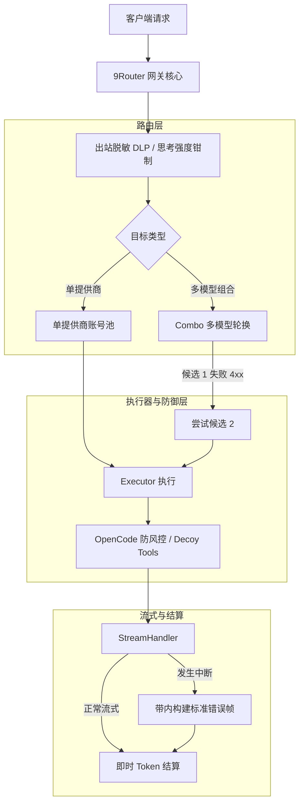

# Design: 上游基线同步至 v0.5.81

## Context & Motivation

本项目遵循 ADR 0003（源码内嵌与上游同步机制）与 ADR 0004（版本号解耦规范）。在将网关源码从 `v0.5.75`（commit `17c4cc76`）推进至 `v0.5.81`（commit `a8c9d380`）时，上游引入了超过 100 个提交，涵盖 Zed 原生鉴权、OpenCode 反风控增强、请求级 4xx 账号免冷却等重要机制。设计目标是**全量对齐上游能力，同时 100% 保持本地专有定制与稳定运行**。

## Decisions

### 决策 1：保留完整双亲历史的 Git Merge

采用 `git merge` 保留 `b374edbd`（iRouter HEAD）与 `a8c9d380`（上游 tag v0.5.81）的双亲提交，而非 rebase 或 squash。这保证后续向上游再次同步时 `git merge-base` 能精确定位三方合并共同祖先，避免重复冲突。

### 决策 2：彻底移除 9Remote / 9English 侧边栏入口

上游在 `src/shared/components/Sidebar.js` 强化了其商业推广入口（9Remote 与 9English 徽标与菜单项）。iRouter 作为纯净的桌面端与开发路由网关，坚决拒绝合并该修改，保持纯净 UI。

### 决策 3：本地 `retryCfg` 与上游请求级 4xx 免冷却机制协同

- 上游引入逻辑：对于非 401/402/403/429 的客户端 4xx 错误（如上下文超长、参数不合法），判定为 `shouldFallback: false, cooldownMs: 0`，避免健康连接被错误移出轮换；
- 本地定制：支持通过设置中的 `retryCfg` 自定义退避基数、上限以及关闭退避（`backoff: false`）；
- 协同裁决：保留上游请求级 4xx 免冷却，并在退避计算中继续透传 `retryCfg`。

### 决策 4：Combo 跨提供商/跨模型轮换与 4xx 容灾保证

- 冲突衍生问题：上游在 `accountFallback.js` 中将 4xx 判定为 `shouldFallback: false` 后，`combo.js` 同样复用了该函数，导致多模型组合在遇到首个成员 400（例如上下文长度超限、模型暂不支持 tools 等）时直接终止了整个 Combo 链；
- 架构裁决：在 `combo.js` 中明确区分**单提供商内部账号轮换**与**跨模型/跨提供商组合容灾**。对于 Combo 轮换，单成员 4xx 不阻断后续备选模型继续尝试（`allowComboFallback = shouldFallback || (result.status >= 400 && result.status < 500)`），使 Combo 的容灾兜底核心价值不受破坏。

### 决策 5：思考强度上限主动钳制与 `display` 参数并存

在 `open-sse/translator/concerns/thinkingUnified.js` 中：
- 本地定制：`effortCap` 强制对下游请求的思考档位进行降级钳制（`capEffort`），防止超出模型承受范围；
- 上游特性：支持通过 `display` 参数控制思考内容的返回形式；
- 协同裁决：在输出参数中同时挂载 `effort`、`display` 与钳制后的档位。

### 决策 6：流式中断带内错误字节与即时 Token 结算

在 `open-sse/utils/streamHandler.js` 与 `open-sse/handlers/chatCore/streamingHandler.js` 中：
- 上游特性：流式中断时在带内生成符合 OpenAI 规范的错误 SSE 字节帧（`buildStreamErrorBytes`），并向外传递 `abortMessage`；
- 本地定制：在流式中断触发 `catch` 或断开时，利用 `transformStream` 即时提取已收发的 delta，完成对中间态 Token 用量的精确扣费与账单记录；
- 协同裁决：完整合并两项能力，既对外发送标准错误字节，又保留本地即时 Token 结算。

### 决策 7：OpenCode 免费端点风控防御与模型识别

- 上游特性：采用确定性会话映射（`x-opencode-session`）、注入 Agent 必备的 decoy tools（bash, glob, grep, read 等伪装工具）；
- 本地定制：支持通过 `baseUrl` 自定义中转 Responses 模型，且不仅支持静态注册模型，亦通用支持 `isMuseSparkModel`；
- 协同裁决：采用上游完整的防风控实现，同时恢复 `isResponsesModel` 对 `isMuseSparkModel` 的识别，保障中转自建节点的顺畅调用。

## Architecture & Data Flow

## Verification & Acceptance

1. **快照一致性**：`verify-providers.mjs` (81 providers), `verify-alias.mjs` (117 tokens), `verify-oauth-urls.mjs` 均为 byte-for-byte 完全一致；
2. **回归门禁**：全量 Vitest 测试套件经 `verify-no-regression.mjs` 检验为 0 regression（原有已知失败全覆盖，甚至减少 3 处）；
3. **前端全量构建**：`npm run build` 136 个静态/动态页面编译成功，standalone 产物生成无误；
4. **桌面冒烟验证**：Electron 壳层启动、内置 Next.js 独立网关、面板渲染、多语言切换、单实例锁定与数据无感导入均 100% PASS。
