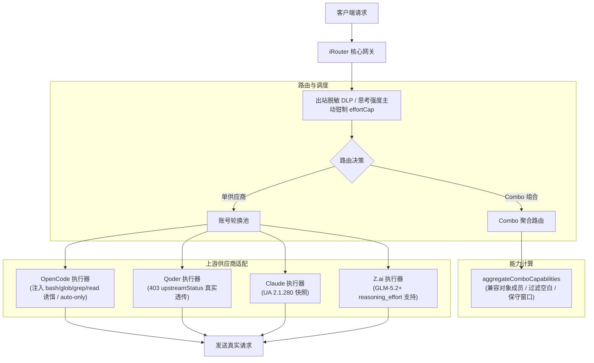

# Design: 上游基线同步至 v0.5.86

## Context & Motivation

本项目遵循 ADR 0003（源码内嵌与上游同步机制）与 ADR 0004（版本号解耦规范）。在将网关源码从 `v0.5.81`（commit `a8c9d380`）推进至 `v0.5.86`（commit `39e36d3d`）时，上游引入了 50+ 个提交，涵盖 OpenCode Free 诱饵工具防风控机制、Qoder 403 限流穿透、Combo 聚合能力、Usage 看板三模式切换等核心演进。设计目标是**吸收第一至第三梯队全部高质量改进，坚决阻断第四梯队商业推广与构建冗余，100% 保持本地专有定制与稳定运行**。

## Decisions

### 决策 1：基于上游基线链生成标准 Merge Commit

通过配置 upstream 远端抓取官方 tag `v0.5.86`，基于其对应 commit `39e36d3d` 生成 `v0.5.86` 基线 commit `f55afb92`，保持与前序基线 `a2281ad8` 的父子拓扑连接。创建 `sync/v0.5.86` 分支执行 `--no-ff` 三方合并，确保后续上游再次同步时 `git merge-base` 能够精确识别三方共同祖先，避免重复冲突。

### 决策 2：坚决阻断第四梯队内容（商业推广与构建流水线）

针对上游引入的第四梯队变动采取严格过滤策略：
- **UI 界面纯净化**：彻底拒绝 `src/shared/components/Sidebar.js` 中关于 9Remote 与 9English 的任何商业推广入口与徽标，保持 iRouter 侧边栏的专注与纯净；
- **清理 Docker 构建流水线**：移除上游引入的 `.github/workflows/docker-publish.yml`、`DOCKER.md`、`Dockerfile`，本桌面与本地网关项目不依赖上游 Docker 发布流；
- **剔除无关文档**：排除印尼语教程等外部无关文档，恢复 `open-sse/AGENTS.md`。

### 决策 3：保护本地专有定制（DLP、Retry、EffortCap、Combo 容灾）

在解决 11 处交集冲突时，严格落实本地专有能力保护：
- **出站 DLP 数据脱敏**：出站脱敏过滤逻辑完整保留，确保敏感凭证与敏感字段不外泄；
- **自动重试与退避配置**：保留 `accountFallback.js` 中的 `retryCfg`（支持禁用指数退避与自定义冷却时间）；
- **思考强度主动钳制**：在 `src/app/(dashboard)/dashboard/combos/page.js` 中保留 `handleSetEffortCap` 交互，并在 `open-sse/translator/concerns/thinkingUnified.js` 中保留 `effortCap` 钳制能力；
- **Combo 跨模型 4xx 容灾**：保留跨模型组合在遇到单模型 4xx 时不中断并尝试备用模型的策略。

### 决策 4：解决 `aggregateComboCapabilities` 边界缺陷

上游引入的 `aggregateComboCapabilities` 仅支持纯字符串形式且未做空标识清洗，当传入包含 `{ model: "..." }` 对象或空白字符串时会产生运行时 TypeError 或将保守窗口错误拉低至 200k。
- **架构改进**：在 `open-sse/providers/capabilities.js` 中兼容对象与字符串成员提取，过滤空白成员；过滤后无有效成员时安全返回 null。同时保留递归嵌套 Combo 的能力，保证了木桶原则对保守窗口计算的准确性。

### 决策 5：GLM-5.2+ 思考强度映射修复

上游在 `capabilities.js` 中声明了 `*glm-5.2*` 的通配规则，但在 `MODEL_CAPABILITIES["glm-5.2"]` 精确条目中遗漏了 `thinkingEffortSupported: true`，导致精确匹配优先原则触发时回退为默认的 `false`，从而在 `thinkingUnified.js` 中丢失了 `reasoning_effort`。
- **改进方案**：在 `MODEL_CAPABILITIES["glm-5.2"]` 中显式添加 `thinkingEffortSupported: true`，确保 z.ai 格式正确识别并输出 `reasoning_effort`。

### 决策 6：OpenCode Free-Tier 防风控四件套指纹适配

上游为了规避 OpenCode 免费池频繁拦截的 403 FreeTierError，在 `OpenCodeExecutor.transformRequest` 中强制注入了 bash/glob/grep/read 四件套诱饵工具，并将 Responses 模式下的缺省 `tool_choice` 设为 `"auto"`。
- **适配方案**：单测断言由原本的工具全等检查适配为包含业务工具集合（`expect.arrayContaining`），并校验总长度为 5；同时对齐 caller 未传 `tool_choice` 时被赋予 `"auto"` 的规范行为。

### 决策 7：Qoder 403 限流状态码透传与账号故障转移协同

在 `open-sse/handlers/chatCore/sseToJsonHandler.js` 中合并上游变更：在上游返回 403 时保留真实状态码，并通过 `upstreamStatus` 透传至上层调度器，避免被统一包装为 500 而错失供应商健康状态转移与冷却时机。

### 决策 8：Tailwind v4 样式类规范化

上游在部分组件中引入了未在 `src/app/globals.css` 声明的颜色类（如 `bg-bg-subtle`、`bg-bg-secondary`、`text-text-primary`）。
- **规范方案**：统一替换为项目标准规范类 `bg-surface-2` 和 `text-text-main`，确保全平台样式渲染一致且消除单测报警。

## Architecture & Data Flow

