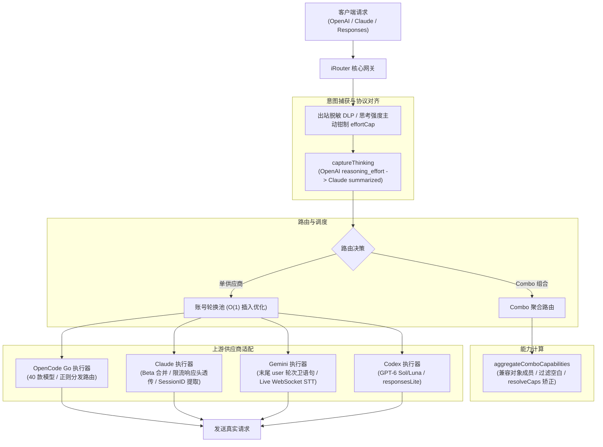

# Design: 上游基线同步至 v0.5.91

## Context & Motivation

本项目遵循 ADR 0003（源码内嵌与上游同步机制）与 ADR 0004（版本号解耦规范）。在将网关源码从 `v0.5.86`（commit `39e36d3d`）推进至 `v0.5.91`（commit `f01fb909`）时，上游引入了 38 个提交，涵盖 OpenAI 格式客户端 Claude 思考过程还原、Responses API 终态输出补全、Gemini 末尾轮次卫语句、Provider 插入性能 O(1) 优化、Zed 凭证自动导入、Claude 限流免费重置等重要演进。设计目标是**全量吸收第一至第三梯队全部高质量改进，坚决阻断第四梯队商业推广，100% 保持本地专有定制稳定运行**。

## Decisions

### 决策 1：基于前序基线拓扑生成基线 commit 与执行三方合并

基于上游 tag `v0.5.91` 源码 tree 生成新的基线 commit `0b6b42c5`，其 parent 显式指向前序基线 commit `f55afb92`（v0.5.86）。在 `sync/v0.5.91` 工作分支上执行 `git merge --no-ff 0b6b42c5`，git 利用共同祖先精确计算 38 个提交的差异，确保合并历史脉络清晰且便于后续可持续同步。

### 决策 2：坚决阻断第四梯队商业推广与冗余构建

- **侧边栏纯净化**：在解决 `src/shared/components/Sidebar.js` 冲突时，严格剔除 `NineRemotePromoModal`、`Button`、`ConfirmModal` 等第四梯队商业推广依赖，仅合入性能优化所需的 `useSettingsStore`；
- **排除 Docker 构建流**：不引入上游 Dockerfile 和 docker-publish 流水线，保持桌面和本地客户端纯净。

### 决策 3：保护本地专有定制机制

- **思考强度主动钳制叠加防护**：在 `open-sse/translator/concerns/thinkingUnified.js` 中，将上游针对不接受 `"max"` 档位后端（如 MiMo v2.5-pro）的自动降级防护与本地 `capped(...)` 思考强度主动钳制机制复合，两级防护共同作用；
- **Combo 健壮性增强与能力矫正融合**：在 `open-sse/providers/capabilities.js` 中，将上游 `resolveCaps` 机制与本地对对象格式成员（`{ model: "..." }`、`{ id: "..." }`）的解构及空白字符清洗逻辑完美融合。

### 决策 4：协议健壮性升级

- **Claude 思考还原**：在 `thinkingUnified.js` 中捕获 OpenAI 格式客户端的 `reasoning_effort` 意图，自动附加 `thinking.display: "summarized"`，配合 `stripAll` 彻底防止 `<think>` 标签泄漏；
- **Responses API 流式终端汇总**：在 `openai-responses.js` 中按 `output_index` 记录流式 output item，并在 `response.completed` 事件的 `response.output` 中全量输出，解决 GitHub Copilot CLI 抛错；
- **Gemini 末尾轮次卫语句**：在 `normalizeGeminiContents` 中，当历史以 `model` 角色或未解决的 `functionCall` 结尾时，自动追加虚拟 user 轮次或 Continue，杜绝 400 报错；
- **Claude 工具名降级脱敏安全兜底**：在 `claudeCloaking.js` 中增加未命中 `toolNameMap` 时的剥离后缀回退机制。

### 决策 5：版本规范与元信息解耦（ADR 0004）

- 根目录 `package.json` 基线版本推进至 `0.5.91`；
- 桌面端产品版本在 `desktop/package.json` 保持独立的 `0.3.1`，描述更新为 `基于上游 v0.5.91 定制`；
- 更新 `CONTEXT.md`、`README.md` 与 `README.zh-CN.md`。

## Architecture & Data Flow

