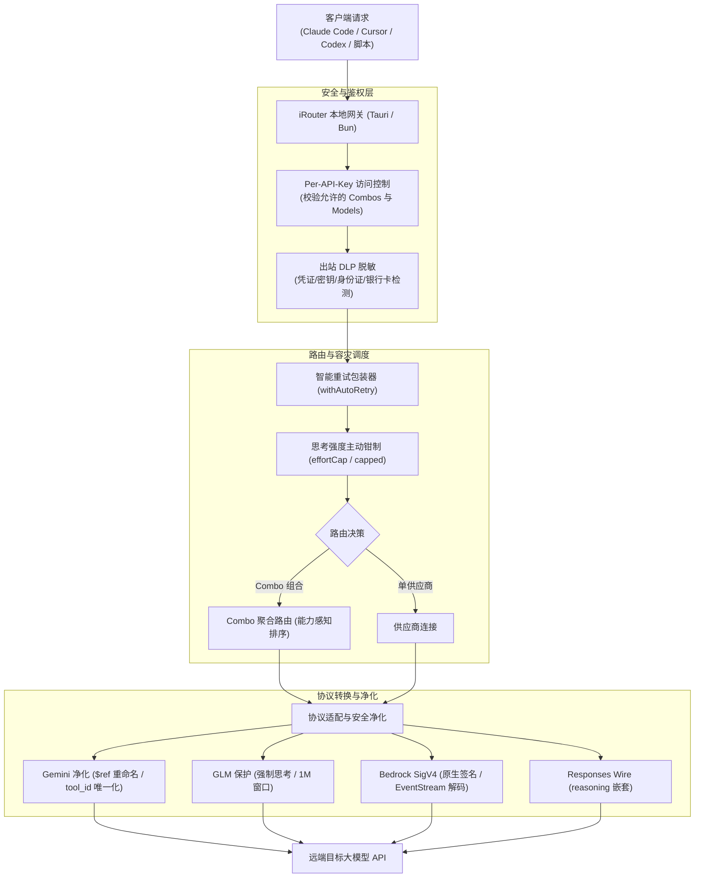

# Design: 上游基线同步至 v0.5.99

## Context & Motivation

本项目遵循 ADR 0003（源码内嵌与上游同步机制）与 ADR 0004（版本号解耦规范）。在将网关源码从 `v0.5.95`（commit `a99cf572`）推进至 `v0.5.99`（commit `ce4460ef`）时，上游引入了 27 个提交，涵盖 Per-API-Key 访问控制、AWS Bedrock 原生轻量接入、MiniMax Code 渠道、Gemini MCP `$ref` 净化、GLM-5.3 强制思考约束、Responses API 协议与思考参数规范化、Antigravity 模型目录全面刷新等重要演进。设计目标是**全量吸收第一至第三梯队全部高质量改进，坚决阻断第四梯队商业推广，100% 保持本地专有定制稳定运行**。

## Decisions

### 决策 1：基于前序基线拓扑生成基线 commit 与执行三方合并

基于上游 tag `v0.5.99` 源码 tree 生成新的基线 commit `7fc77f63`，其 parent 显式指向前序基线 commit `2d71fc9d`（v0.5.95）。在 `sync/v0.5.99` 工作分支上执行 `git merge --no-ff 7fc77f63`，借助 Git 共同祖先精准定位 27 个提交的差异，确保合并历史脉络清晰且便于后续可持续同步。

### 决策 2：坚决阻断第四梯队商业推广

- **侧边栏纯净化**：在解决 `src/shared/components/Sidebar.js` 冲突时，严格剔除上游引入的 9Remote 外部推广链接（`2d94d3ab`）及 Web 端更新弹窗，维持桌面客户端的极简纯净；
- **排除外部推广按钮**：在 `Header.js` 中坚决剔除 Donate 按钮，仅保留搜索组件。

### 决策 3：保护本地专有定制机制

- **思考强度主动钳制叠加防护**：在 `open-sse/translator/concerns/thinkingUnified.js` 中，将上游针对 Claude `minimal -> low` 的适配与 Responses API `reasoning: { effort, summary }` 的嵌套适配，与本地 `capped(...)` 思考强度主动钳制机制复合，确保任何 wire format 均受到本地思考档位上限的安全钳制；
- **管道主链三重协同**：在 `src/sse/handlers/chat.js` 中，将上游新增的 `validateKeyAccess` 鉴权置于最前置拦截层，与后续执行的本地出站 DLP 脱敏（`applyRequestRedaction`）和智能重试（`withAutoRetry`）形成清晰有序的分层架构。

### 决策 4：协议健壮性与稳定性升级

- **Gemini MCP `$ref` 键脱敏净化**：在 `normalizeGeminiContents` 中将 `functionResponse` 内所有的 `$ref` 键重命名，彻底规避 Google Vertex/Gemini 将其误认作内部指针而报 400 错误的顽疾；
- **GLM-5.3 强制思考与 1M 上下文对齐**：标记 `thinkingCanDisable: false`，杜绝禁用思考触发智谱 400 错误码 1210；
- **AWS Bedrock 轻量级集成**：基于 `node:crypto` 的轻量 SigV4 实现，不依赖庞大的 AWS SDK 全家桶，保持桌面端轻量。

### 决策 5：版本规范与元信息解耦（ADR 0004）

- 根目录 `package.json` 基线版本推进至 `0.5.99`；
- 桌面端产品版本在 `desktop-tauri/package.json` 保持独立的 `0.4.0`；
- 更新 `CONTEXT.md`、`README.md` 与 `README.zh-CN.md` 中的历史基线号描述为 `v0.5.99`，产品版本号修正为 `0.4.0`。

## Architecture & Data Flow

